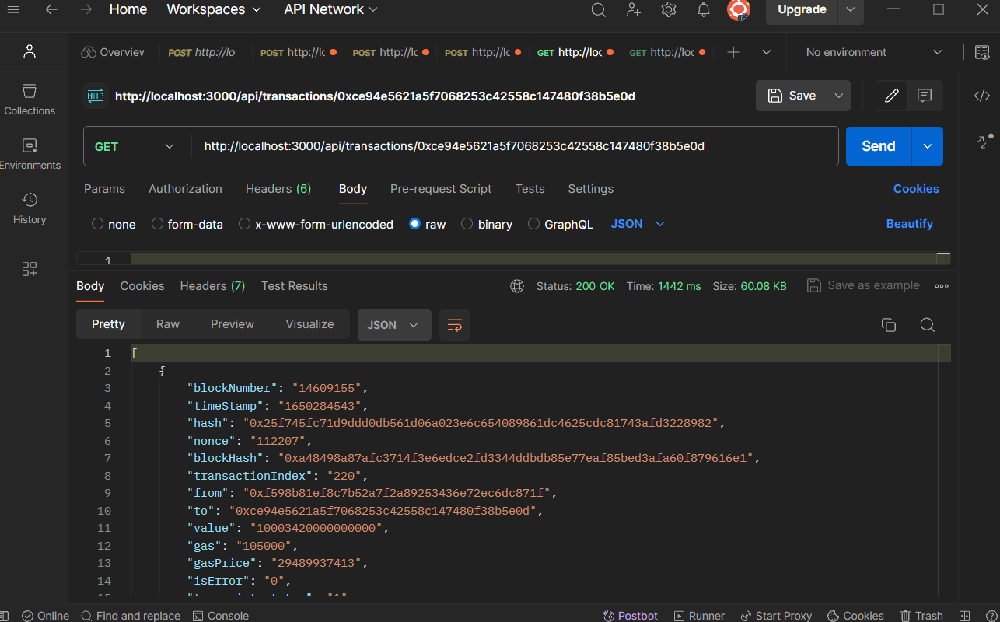
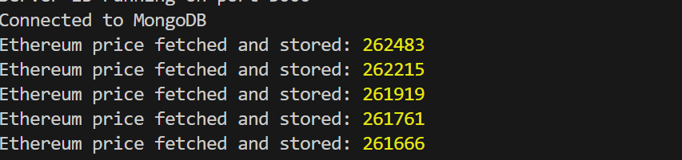
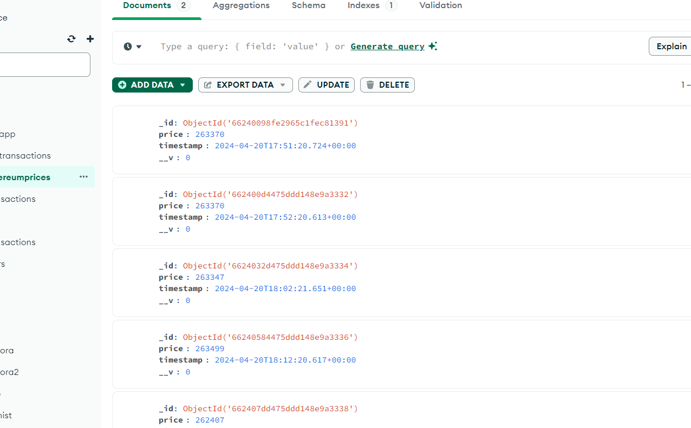
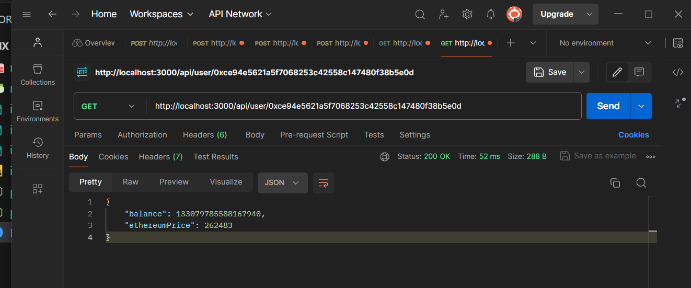

# KoinX Internship Assessment (Ethereum Transaction Tracker)

This project is a backend application built with Node.js for tracking Ethereum transactions of users and fetching the current balance and price of Ethereum.

## Features

- Fetch Ethereum transactions for a given user address.
- Calculate the user's current balance based on transactions.
- Fetch the current price of Ethereum from an external API.
- Store transactions and Ethereum prices in a MongoDB database.
- Expose API endpoints to retrieve user balance and Ethereum price.

## Installation

1. Clone the repository:
    ```git clone https://github.com/Arjun0023/KoinX```

2. Install dependencies:
    `npm install`

3. Start the server: node index.js

4. Access the API endpoints:
   - Fetch Ethereum transactions: `GET /api/transactions/:address`
   - Get user balance and Ethereum price: `GET /api/user/:address`

Replace `:address` with the Ethereum address of the user.








# small message for recruiter ;> 
`I could not deploy my database and Backend to Atlas and AWS EC2 because of my debit card , but can surely do during internship`